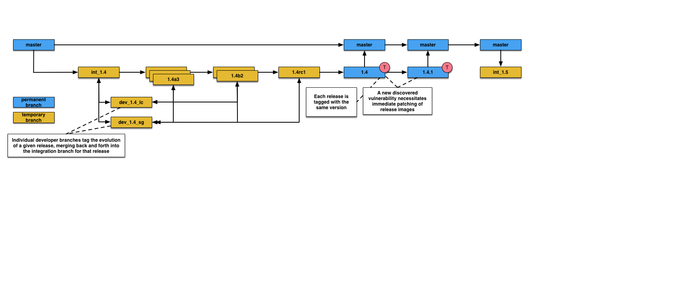

============
Git Workflow
============

Branches
========

Every new major or minor version of ESGF should correspond to an integration branch  
named after the version. The development of a major version takes obviously longer
then a minor version. But some minor versions may be in development at the same
time as a major version. That is why we should not develop ESGF in a single
dedicated integration branch with a meaningless name. **The integration branches
receive the merges from personal branches. No one should push directly into the
integration branches** as the integration branches reflect the head of the 
development of the software.

**Personal branches are the branches where the developers push their commit**.
These branches are the place for unit testing and integration testing.

**Master branch should always represents the last production/maintenance
release. We should not push any commit in the master branch**. We should only
merge commits, from integration branches, that contribute to the last
production/maintenance release. **Personal branches, development tags, even
integration branches may be deleted**. So don’t forget to merge commits on the master
branch at every production/maintenance release. Master branch must never been
deleted.

Release/tags
============

**Every release** (alpha, beta, rc and of course production/maintenance
release) **should be tagged** so as the installation scripts can rely on fixed states
of ESGF. 

As tags and releases are equivalents, the tag names have exactly the same syntax as
their counterpart.
Production/maintenance tags must never been deleted. Alpha, beta and
rc releases may be deleted. Production tags are made from the master branch whereas
development tags are made from integration branches.

Signing the git tag for the production/maintenance releases will improve the
security.

We should be careful to never make gaps in the version numbering

Naming rules
============

Recommended naming rules for git:

- The integration branch name syntax is int_X.Y where X and Y represents the version of
  the software been developed. Example: int_2.5 for the future version v2.5.0

- The personal branch name syntax is dev_X.Y_[PersonalTag] where where X and Y
  represents the version of the software being developed and [PersonalTag] an
  unique tag that is specific to a developer.

Integration
===========

Developers work on their own development branch and the integration tests must 
be executed in the development branch so as to prevent failures in the
integration branch. Every time they need to merge
their contributions into the current integration branch, the following procedure
applies:

- Checkout the development branch.
- Merge the integration branch into the devevelopemnt branch.
- Build the docker images, run the images then run the automatic tests.
  If the test pass, continue.
- Push to the remote development branch
- Checkout the integration branch
- Merge the development branch into the integration branch.
- Push to the remote integration branch

Diagram
=======

Schematic representation of how Git branches are created and tagged when working on a specific release.

   

